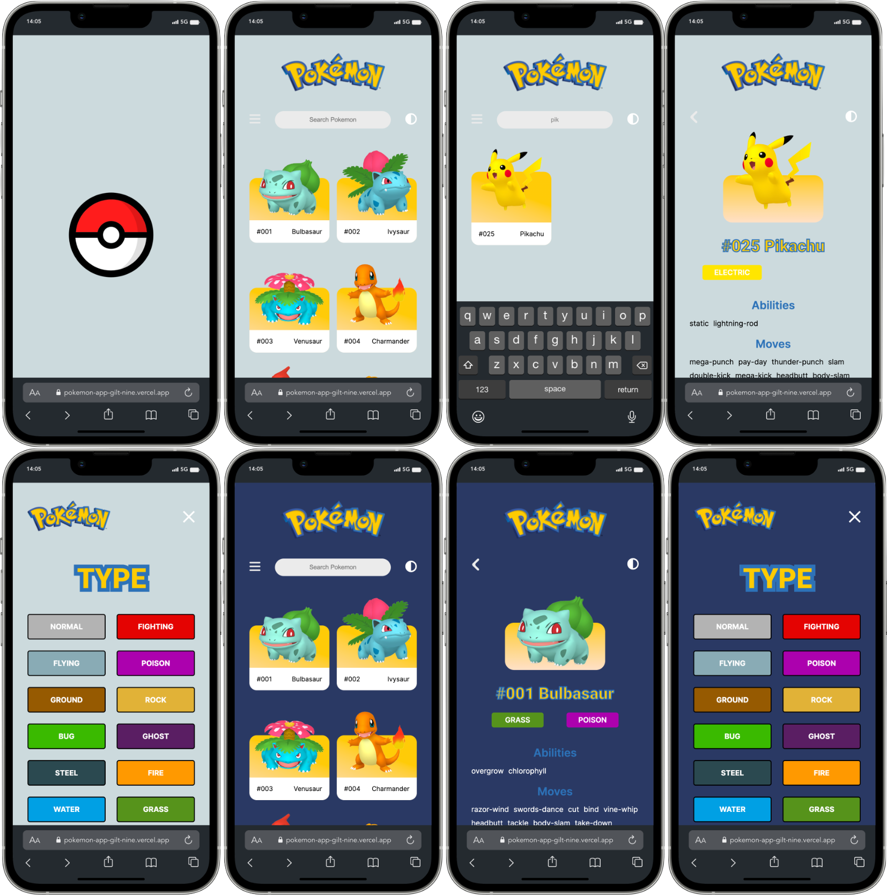

# Collaborative project: Mobile Pokemon App

## Contributors

- [Anna Gofman](https://github.com/Nostea)
- [Christian Angerer](https://github.com/ChrissQAng)
- [Thomas Erdmenger](https://github.com/thomaserdmenger)

## Purpose of the App

- Search for Pokemon
- Search Pokemon by type
- Display the details of the respective Pokemon

## Built with

- Mobile Design
- Grid and Flexbox Layout
- React
- React Router DOM
- Fetch API
- PokeAPI
- Dark Mode
- Splash Screen

## Links

- [See live site here](https://pokemon-app-x9pp.onrender.com)
- [GitHub Repository](https://github.com/thomaserdmenger/Pokemon-App)
- [GitHub Author](https://github.com/thomaserdmenger)
- [LinkedIn Author](https://www.linkedin.com/in/thomaserdmenger/)

## Screenshot-Image

